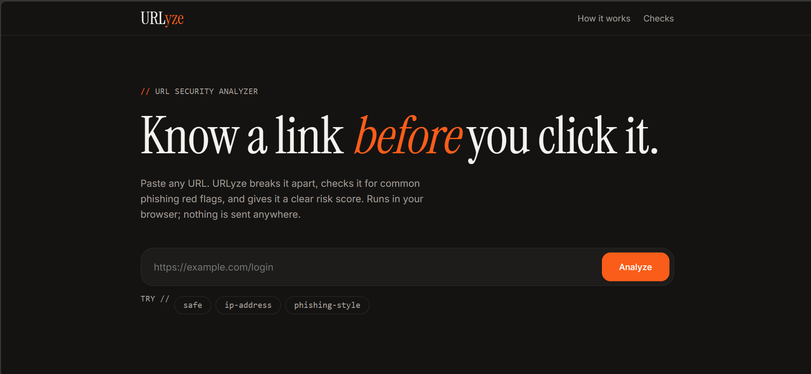

# URLyze

A URL security analyzer that breaks a link into its parts, checks it for common phishing red flags, and gives it a 0–100 risk score with a plain-language reason for every point.

Runs entirely in the browser. No server, no tracking, and no URL is ever sent anywhere.



**Live demo:** https://itsyouness.github.io/url-security-analyzer/ *(enable GitHub Pages in Settings → Pages)*

## Features

- **URL anatomy:** scheme, host, subdomains, domain, TLD, port, path, query and fragment
- **12 heuristic checks** with weighted points
- **Risk score:** Low (0–19), Medium (20–49), High (50–100)
- **Explanations:** every flag says why it matters
- **Responsive design** with light and dark mode
- **Zero dependencies:** one HTML file, no build step

## Checks

| Check | Points | Why it matters |
|---|---|---|
| No HTTPS | +15 | Traffic can be read or altered |
| IP address as host | +25 | Legitimate sites almost always use domain names |
| `@` in the URL | +20 | Browsers ignore everything before `@`, hiding the real host |
| Punycode (`xn--`) | +20 | Look-alike characters can imitate trusted brands |
| URL shortener | +10 | The final destination is hidden |
| Suspicious TLD | +10 | Some TLDs are common in abuse campaigns |
| Too many subdomains | +10 | Can bury the real domain |
| Non-standard port | +10 | Unusual for public websites |
| Phishing keywords | +10 | `login`, `verify`, `secure`, `account`, etc. |
| Embedded redirect | +10 | Another URL is inside the URL |
| Long URL | +5 | Over 75 characters can hide the real host |
| Many hyphens in host | +5 | Common in fake brand domains |
| Heavy `%` encoding | +5 | Can disguise the real content |

The total is capped at 100.

## Run it

Open `index.html` in any modern browser. That's it.

Or clone the repo:

```bash
git clone https://github.com/itsyouness/url-security-analyzer.git
cd url-security-analyzer
```

## Project structure

```
url-security-analyzer/
├── index.html   # the whole app: HTML, CSS and JavaScript
├── README.md
├── LICENSE
└── .gitignore
```

## Limitations

- URLyze only inspects the **text** of the URL. It does not fetch the page or check live reputation databases, so a clean score does not guarantee a link is safe.
- Heuristics can produce false positives and false negatives.
- TLD and domain splitting uses a small built-in list of two-part suffixes (like `co.uk`), not the full Public Suffix List.

## Roadmap

- [ ] Reputation lookups (Google Safe Browsing, VirusTotal)
- [ ] WHOIS / domain age check
- [ ] Look-alike detection against popular brands
- [ ] Redirect-chain tracing
- [ ] Python command-line version
- [ ] Export report as JSON

## What I learned

Built as a cybersecurity portfolio project. It covers URL structure and anatomy, how phishing links disguise themselves, and designing a weighted scoring model with explainable results.

## License

Released under the [MIT License](LICENSE).
